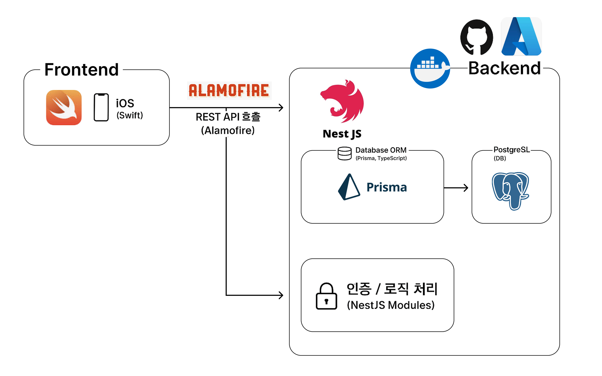

# 🌏 월스 - 다문화 학생과 한국 학생이 함께 성장하는 멘토링 학습 도우미

> **기간:** 2025.05.22 ~ 2025.06.12  
> **버전:** v1 (현재 문서는 버전1 기준입니다)
> 
>📒 팀 노션:  
 🔗 [World-Study 팀 페이지](https://www.notion.so/World-Study-_-01-224800c9877b803594a0d2782cb0df66?source=copy_link)

현재는 버전 v2 개발 진행 중입니다.

배포를 목표로 기능 고도화 및 추가, 안정화 작업이 이루어지고 있습니다.

버전2 관련 사항은 추후 업데이트될 예정입니다.

---

## 📝 프로젝트 소개
 **월스(WorldS)** 는 다문화 학생과 한국 학생이 멘토-멘티로 연결되어  
서로의 언어와 문화를 배우며 함께 성장할 수 있도록 돕는 **멘토링 기반 학습 도우미 앱**입니다.

 버전1에서는 iOS 플랫폼에서 **OCR(문자 인식)** 과 **번역 기능**을 활용하여  
멘토링 과정에서 언어 장벽을 낮추는 데 집중했습니다.  
Apple의 **Vision 프레임워크**와 기본 **번역 API**를 사용하여 구현되었으며,  
직관적인 UI와 간단한 기능 위주로 빠르게 프로토타입을 완성했습니다.

---

## 📱 주요 기능

**📘 AI 숙제 도우미**  
  - 다문화 아동과 부모의 언어 장벽을 줄여주는 실시간 AI 번역 학습 도우미
  - 앱에 탑재된 카메라를 이용하여 안내문/숙제 촬영 시, 부모의 언어로 번역

**🏆 멘토 랭킹 시스템**  
  - 활동량을 기반으로 한 멘토 랭킹 표시로 동기 부여와 경쟁 유도

**💬 커뮤니티 공간**  
  - 자유롭게 이야기 나누고 친목을 다질 수 있는 열린 커뮤니티 게시판

 

  
  

  
  

  
  

    
---

## 🚧 기술 아키텍쳐

---

## 😼 구성원 소개  
| 이름   | 역할     | 설명             |
|--------|----------|------------------|
| 이다은 | 풀스택   | 프론트엔드 및 백엔드 전반 개발 담당 |
| 이서하 | 풀스택   | 프론트엔드 및 백엔드 전반 개발 담당 |
